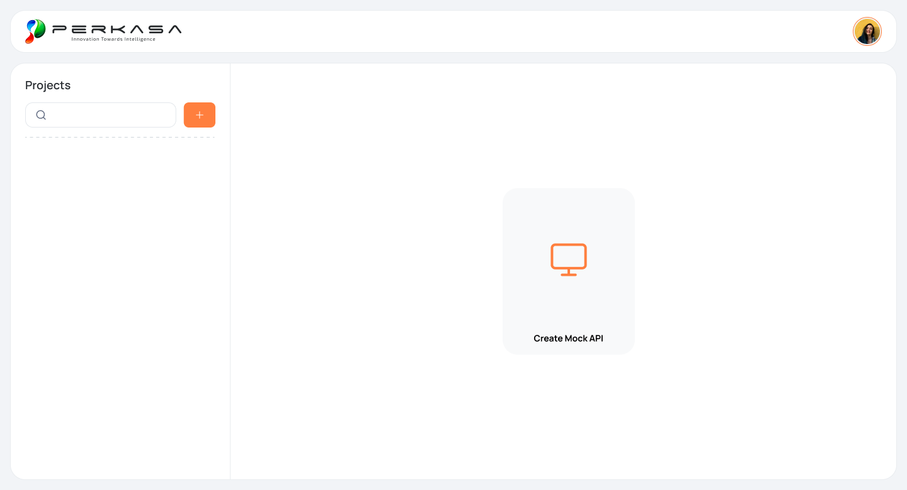
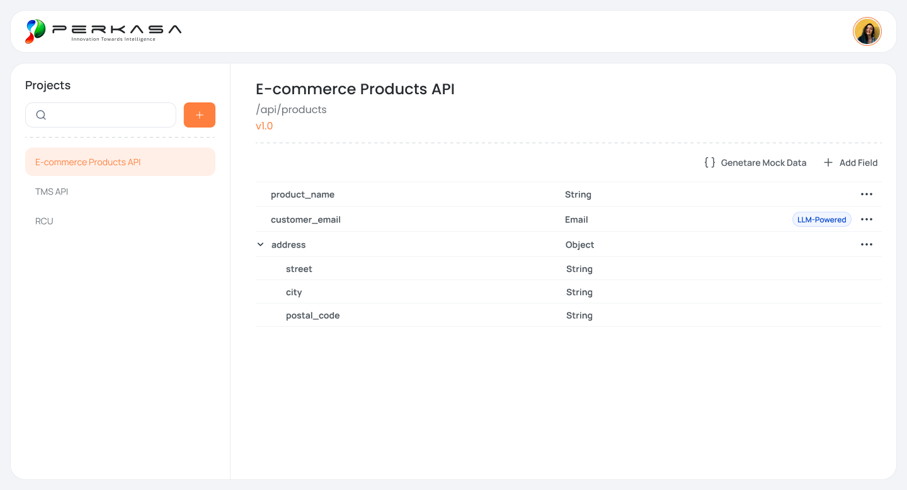
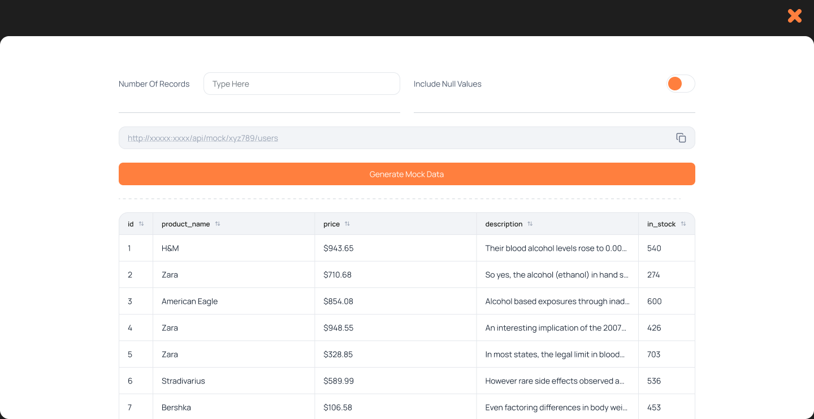

# Figma Design Reference

**Figma file:** [MOCKDATA](https://www.figma.com/design/LB6eZhPo583NkdVxjbIIzA/MOCKDATA?node-id=71-252&p=f&t=Igpcud4b0lVTobNi-0)  
**Captured node:** `71:252` (`Prototype`)  
**Capture date:** 2026-06-23  

This document is the stable visual reference for implementing the mock data generator UI. It was created from the view-only Figma file and local screenshots saved under `docs/design/assets/figma/`.

## Design Principles

- Keep the product shell quiet and spacious: light gray page background, white rounded surfaces, thin dividers, and restrained text color.
- Use orange as the primary action color. The design uses it for create/add actions, active project state, version accents, and the generate button.
- Keep the main workspace desktop-first at `1440px` wide, with a fixed left project rail and a flexible right content area.
- Prefer simple table/list presentation over dense cards for schema fields and generated records.
- Treat generated data as a work surface: form controls first, generated endpoint second, primary action third, result table below.

## Visual Language

| Element | Figma signal | Implementation note |
|---|---|---|
| Page background | Very light gray | Use the app shell background outside major cards. |
| Header | White rounded rectangle, 16px page inset | Contains brand logo on the left and avatar on the right. |
| Main content | White rounded rectangle, 16px page inset | Split into left project rail and right workspace. |
| Borders/dividers | Thin light gray lines, sometimes dashed | Use subtle contrast; avoid heavy borders. |
| Primary action | Orange filled button | Used for plus buttons and "Generate Mock Data". |
| Active project | Pale orange row with orange text | Indicates selected project in the left rail. |
| Secondary action | Text/link button with icon | Used for "Generate Mock Data", "Add Field", edit/delete menu actions. |
| Semantic badges | Blue pill | Used for LLM-powered semantic fields such as Email. |

Exact Figma variables were not available through the connector without an active Figma selection, so implementation should use close visual matches and centralize values as CSS variables or shared utility classes.

## Screen: Project Empty State

**Figma node:** [`71:253`](https://www.figma.com/design/LB6eZhPo583NkdVxjbIIzA/MOCKDATA?node-id=71-253&p=f&t=Igpcud4b0lVTobNi-0)  
**Local screenshot:** `docs/design/assets/figma/project-empty.png`

Purpose:

- Show the authenticated project dashboard when the user has no selected or persisted projects.
- Provide project search and creation entry points.
- Keep the empty state focused on one large "Create Mock API" card.

Layout:

- Header at `16px` from the viewport edges, `68px` tall, full width minus page gutters.
- Main content starts at `y=100`, has `16px` page gutters, and is `664px` tall in the captured desktop frame.
- Left project rail is `350px` wide.
- Right workspace starts after a vertical divider and centers the create card.

Important elements:

- Brand/logo in header left.
- Circular avatar in header right.
- Left rail title: `Projects`.
- Search input with search icon.
- Orange square plus button.
- Center empty card with orange monitor icon and label `Create Mock API`.

## Screen: Schema Builder With Fields

**Figma node:** [`71:339`](https://www.figma.com/design/LB6eZhPo583NkdVxjbIIzA/MOCKDATA?node-id=71-339&p=f&t=Igpcud4b0lVTobNi-0)  
**Local screenshot:** `docs/design/assets/figma/schema-fields.png`

Purpose:

- Show a selected project and its current schema version.
- Provide schema actions: generate mock data and add field.
- Display fields recursively, including nested object fields.

Layout:

- Same shell as the project empty state.
- Left rail shows project list with the selected project highlighted.
- Workspace header shows project name, base endpoint, and version badge/text.
- Dashed divider separates project metadata from actions and field list.
- Field rows are table-like with name, type, optional badge, and an overflow action menu.

Visible content:

- Project: `E-commerce Products API`
- Base endpoint: `/api/products`
- Version: `v1.0`
- Actions: `Generate Mock Data`, `Add Field`
- Fields:
  - `product_name` as `String`
  - `customer_email` as `Email` with `LLM-Powered` badge
  - `address` as `Object`, expanded
  - nested `street` as `String`
  - nested `city` as `String`
  - nested `postal_code` as `String`

Behavior signals:

- Object fields use a chevron for expand/collapse.
- Field rows use an overflow menu for edit/delete actions.
- Nested fields are indented under their parent object.
- Semantic/LLM-backed fields can show badges in the action area.

## Screen: Mock Data Generation

**Figma node:** [`71:1917`](https://www.figma.com/design/LB6eZhPo583NkdVxjbIIzA/MOCKDATA?node-id=71-1917&p=f&t=Igpcud4b0lVTobNi-0)  
**Local screenshot:** `docs/design/assets/figma/mock-generation.png`

Purpose:

- Let the user generate records from the schema.
- Show the public/mock endpoint with a copy affordance.
- Display generated records in a sortable table.

Layout:

- Appears as a full-screen overlay or modal-like generation workspace.
- Dark backdrop/header area at the top with an orange close icon.
- White rounded content panel begins below the dark top band.
- Form row uses two horizontal controls:
  - `Number Of Records` text input.
  - `Include Null Values` switch.
- Endpoint appears in a full-width disabled/input-like field with copy icon.
- Primary orange `Generate Mock Data` button spans the content width.
- Dashed divider separates controls from table.
- Table has compact header row and visible sorting indicators.

Visible table columns:

- `id`
- `product_name`
- `price`
- `description`
- `in_stock`

Behavior signals:

- Missing record count should validate before generation.
- The null toggle maps to generation null policy.
- Copy icon copies the generated endpoint.
- Table rows should truncate long values without breaking layout.

## Component Inventory

Use these as reusable UI building blocks:

- `AppShell`: page background, header, avatar, content card.
- `ProjectRail`: project search, create button, selectable project list.
- `PrimaryButton`: orange filled action button.
- `IconButton`: orange plus button and row action buttons.
- `CreateProjectCard`: centered empty-state card.
- `ProjectHeader`: name, endpoint, version display.
- `SchemaActionBar`: generate and add-field actions.
- `SchemaFieldList`: recursive field rows with nesting and overflow menu.
- `SemanticBadge`: blue pill such as `LLM-Powered`.
- `GenerationPanel`: record-count input, null toggle, endpoint copy, generate button.
- `GeneratedRecordsTable`: sortable preview table.

## Responsive Notes

The linked frames are desktop captures only. Until mobile frames are supplied, implement desktop faithfully first and use conservative responsive behavior:

- Collapse the left project rail above the workspace on narrow screens.
- Keep actions reachable near the project header.
- Allow horizontal scrolling for generated data tables when needed.
- Preserve accessible labels for icon-only actions.

## Open Design Questions

- Whether the mock data generation screen is a full route, modal, or drawer.
- Exact brand assets and whether the Perkasa logo should be committed as an app asset.
- Exact color, typography, and spacing variables from Figma.
- Mobile layout expectations.
- Empty/error/loading states not shown in the captured frames.
